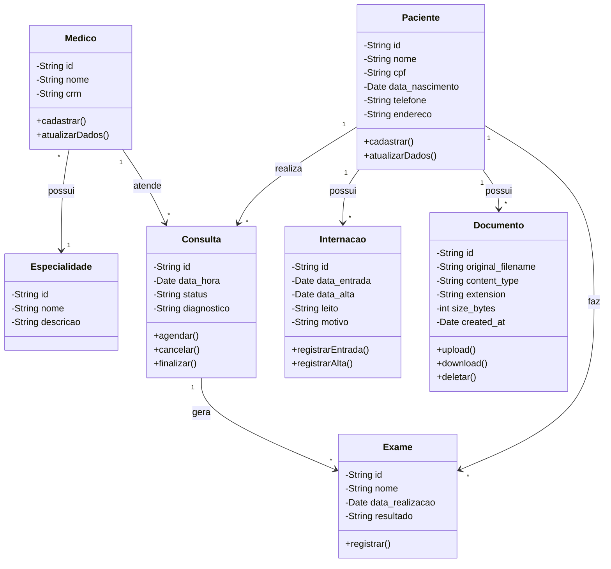

# Sistema de Gestão Hospitalar - API

API para gestão hospitalar com suporte a gerenciamento de entidades (Pacientes, Médicos, etc.) e armazenamento em nuvem de exames e documentos.

## Tecnologias
- **FastAPI**: Framework web Python.
- **MongoDB / Beanie**: Banco de dados NoSQL e ODM.
- **MinIO**: Object Storage (compatível com Amazon S3) para arquivos físicos.
- **Docker**: Orquestração de containers.

## Como rodar o projeto localmente

1. Certifique-se de ter o Docker e Docker Compose instalados.
2. Clone o repositório.
3. Na raiz do projeto, execute:
   ```bash
   docker-compose up --build -d

## Diagrama de Classes

